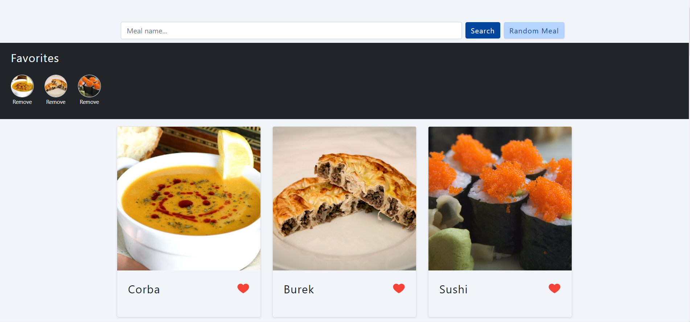

<h1 align="center">Meals Application</h1>

  

<h2>Description</h2>

With this project you can search your favorite meals and see its recipe! 

<h2>Content</h2>

[Description](#description) |
[How to use it](#use) |
[Technologies](#technologies) |
[Run it](#run) |
[Author](#author)

<h2 id='use'>How to use it</h2>
You can select any meal you want in the initial page or you can search a meal by name. In case you want to get surprised just click 'Random Meal' button. 
Loved the meal? Click ❤️ and make it part of your favorite meals. You can see right under the search bar.

<h2 id='technologies'>Technologies</h2>
For this project I used:

- React.js
- React Icons
- Axios (fetch data)
- Bootstrap 5
- localStorage
- TheMealDB API

<h2 id='run'>Run it</h2>
First you have to install:

- Node.js (npm)

1. Open the project folder 
<code>cd meals-application</code>

2. Install the packages 
<code>npm install</code>

3. Start the server 
<code>npm start</code>

Now you should be running the application.

 <h2 id='author'>Author</h2>
    
    <h3>Antero Júnior</h3>
    
Made with ❤️ by Antero Júnior
    

        
        
    

